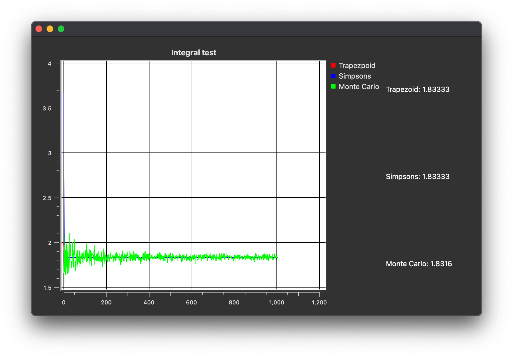

## Introduction
This program is an implementation of numerical integration methods sing the trapezoid method, the Simpson's method and Monte Carlo methods. It is part of Chapter 6 in the computational physics textbook by Landau Landau (2015)[^1] on numerical integration. It is also a good refresher of the topics I learnt in MH3700 Numerical Analysis I that I took in NTU.

[^1]: Landau, R. H. (2015). Computational physics problem solving with python. John Wiley & Sons, Incorporated. 

## Numerical Integration
Integrating numerically involves finding the area under the curve of a function. 
### Trapezoid method
This method involves approximating the area under the curve of the function as a collection of $N$ trapezoids with area $\frac{1}{2}(a+b)h$. The algorithm for this method is then 

$$\int_a^b f(x)dx= \frac{1}{2}\sum_{i=0}^{N-1}(f(a+ih)+f(a+(i+1)h))h$$
 

where $h=\frac{b-a}{N}$
### Simpson's Method
This method invovles approximating the area under the curve of a function as a collection of $N$ parabolas. The algorithm for this method is 

$$\int_a^b f(x)dx = \sum_{i=0}^{N-1}\left[\frac{4}{3}f(a+ih)+\frac{1}{3}f(a+\frac{3ih}{2})+\frac{4}{3}f((i+1)h)\right]$$

### Monte Carlo Method
This method involves making use of the mean value theorem in calculus that states that 

$$\int_a^bf(x)dx=(b-a)\langle f \rangle$$
 

Where $\langle f\rangle$ is the mean of the function in the interval. By the central limit theorem, 

$$\langle f \rangle = \lim_{N\to \infty}\frac{1}{N}\sum_{i=0}^N f(x_i)$$
 

where $x_i$ is a uniformly distributed random number. This method however converges slower than the above methods. For high dimensional integration however, this method is preferred as it is less computationally intensive. 

## Numerical Integration
The function to be integrated is a function TheFunction(double x) that is defined in mainwindow.cpp. As it is a 1D integration it accepts a single variable x. An example that evaluates $\int_0^1 x^2+x+1dx$ is shown below.

As can be seen, the first two methods converge to the correct answer while the Monte Carlo method does not converge but does get very close.